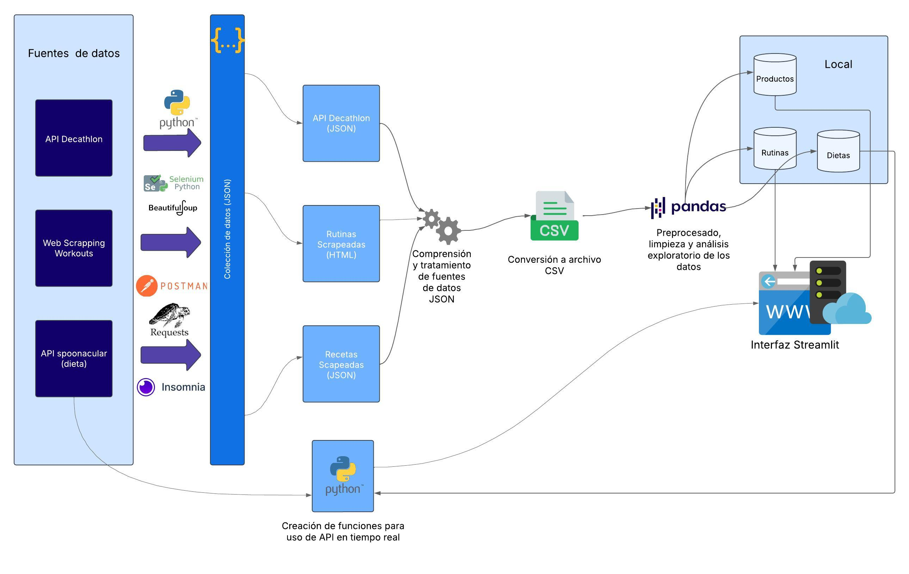

# Proyecto Fitplanner

Fitplanner es una solución para quienes desean optimizar su vida saludable mediante entrenamientos personalizados, sugerencias de recetas ajustadas a necesidades calóricas específicas, y descubrimiento de ofertas deportivas. El proyecto combina técnicas de scraping, consumo de APIs, y visualización interactiva a través de Streamlit.

---

## 🚀 Funcionalidades Principales

- **Rutinas de entrenamiento personalizadas:** Generación de rutinas basadas en diferentes objetivos y niveles de experiencia en el gimnasio.
- **Planificación de comidas:** Recetas adaptadas a las necesidades calóricas.
- **Productos en oferta de Decathlon:** Búsqueda de ofertas en el apartado de musculación de Decathlon.
- **Interfaces interactivas:** Visualización de rutinas, recetas y productos mediante Streamlit.

---

## 🔄 Flujo Completo del Proyecto




---

## 📂 Estructura del Proyecto

```
Proyecto_Fitplanner/
├── App/
│   ├── app.py                  # Archivo principal de la aplicación
│   ├── rutinas.csv          # Datos definitivos rutinas del proyecto
│   ├── filtering.py            # Filtrado de datos
│   ├── mealplanner.py          # Generación de planificaciones de comidas (API spoonacular)
│   └── pages/
│       ├── output.py           # Interfaz de resultados
│       └── productos_paginas.csv # Productos deportivos
├── Decathlon/
│   ├── decathlon.ipynb         # Scraping de productos de Decathlon (API oculta)
│   └── productos_paginas.csv   # Productos de Decathlon
├── Recetas/
│   ├── __init__.py             # Inicialización del módulo
│   ├── filtering.py            # Filtrado de recetas
│   ├── mealplanner_draft.ipynb # Borrador del planificador de comidas
│   ├── mealplanner.py          # Planificador de comidas definitivo
│   └── obsolote_files/         # Archivos obsoletos
└── Rutinas/
    ├── csv_rutinas/            # Datos de rutinas en CSV
    ├── Definitivo.csv          # Datos definitivos de rutinas
    ├── rutinas_expandidas.csv  # Rutinas expandidas
    ├── scraping_limpio_v3.ipynb# Notebook de scraping limpio
    └── workout_con_resumen.json# Resúmenes de rutinas

```

---

## 🛠️ Instalación

1. Clona el repositorio:

   ```sh
   git clone https://github.com/ImadRifai/Proyecto_fitplanner.git
   ```
2. Navega al directorio del proyecto:

   ```sh
   cd Proyecto_Fitplanner
   ```
3. Crea un entorno virtual:
   
   ```sh
   python -m venv env
   ```
4. Activa el entorno virtual:
   
   - En Windows:
   ```sh
   env\Scripts\activate
   ```
   - En Linux y macOS:
   ```sh
   source env/bin/activate
   ```
5. Instala las dependencias necesarias:

   ```sh
   pip install -r requirements.txt
   ```

---

## 🧑‍💻 Uso

### Ejecución de la Aplicación

1. Ejecuta la aplicación principal de Streamlit:

   ```sh
   python App/app.py
   ```
2. Accede a la interfaz web que se abrirá en tu navegador.

### Ejecución de Notebooks

Probablemente casi ningún Notebook se pueda ejecutar correctamente, ya que por razones obvias hemos decidido no publicar nuestras tokens de algunas APIS y los headers en algunos casos.

---

## 🔍 Tecnologías Utilizadas

- **Lenguaje:** Python
- **Framework Web:** Streamlit
- **Scraping:** BeautifulSoup, Selenium, Request
- **Visualización:** Pandas, Matplotlib
- **Gestión de Datos:** Archivos CSV y JSON

## 🤝 Contribuciones

Sigue los siguientes pasos si quieres contribuir al proyecto:

1. Haz un fork del repositorio
2. Crea una rama para tu función (`git checkout -b feature/nueva-funcion`)
3. Realiza tus cambios y haz commit (`git commit -m 'Agrega nueva función'`)
4. Haz push a la rama (`git push origin feature/nueva-funcion`)
5. Abre un Pull Request

---

## 📝 Licencia

Este proyecto está licenciado bajo la Licencia MIT. Consulta el archivo [LICENSE](LICENSE) para más detalles.
